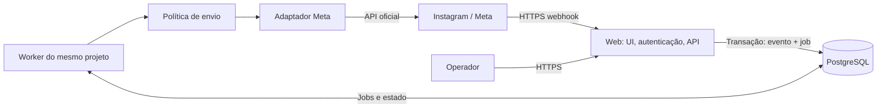

# Arquitetura proposta

Estado: proposta para o produto; o recorte local de bootstrap, fila e modelo de contas de PF-010–012 está implementado e testado. Módulos de Meta, envio, autenticação e interface funcional continuam planejados. Decisões em [ADRs](decisions/README.md); requisitos externos em [VIABILIDADE](VIABILIDADE.md).

Integração: um app Meta operacional com Instagram Login e duas conexões independentes, conforme [ADR-004](decisions/004-onboarding-meta-e-gate.md). Credenciais/callbacks por ambiente não se confundem com isolamento entre contas. O gate de entrega real, inclusive a divergência D-META-01 sobre webhooks em Standard Access, está em [META_ONBOARDING](META_ONBOARDING.md).

## Stack e componentes

Monólito modular TypeScript: Next.js/React para UI e rotas, PostgreSQL para dados e fila durável, Prisma para modelo/migrações, Zod nas fronteiras e **pg-boss** para jobs. Um repositório e uma imagem com dois processos/containers: web e worker. A separação permite reiniciar UI sem perder processamento e evita executar jobs no ciclo de uma requisição HTTP. Não são microsserviços.

Manter a família de ferramentas do OpenReply reduz custo de adaptação. PF-010 fixou Node 24, Next 16.3.6, Prisma 7.10.0 e pg-boss 12.35.0 com lockfile; outras escolhas de produto seguem o gate das respectivas tarefas. Não herdar automaticamente Node 20 da CI upstream ou next-auth beta.

pg-boss oferece jobs transacionais, retry e agendamento no PostgreSQL já necessário ([documentação oficial](https://pgboss.io/), consulta 27/09/2026). A economia é remover Redis e a publicação entre dois sistemas. Ainda há custo de tabelas, vacuum, pooling e concorrência. PF-011 validou o adaptador transacional Prisma/pg-boss nas versões fixadas com PostgreSQL 16 real; monitorar compatibilidade em atualizações. Não escrever uma fila genérica própria nem usar tarefas em memória. Se a integração falhar no futuro, registrar ADR antes de reconsiderar BullMQ; não adicionar Redis silenciosamente.

Sem cache externo, broker, armazenamento de mídia, analytics externo ou serviço de IA no MVP. UI consulta a base local com polling moderado; a sincronização com a Meta é separada, paginada e limitada. WebSocket não é necessário para duas contas.

Autenticação do operador separada do OAuth Instagram: Better Auth foi selecionada na [ADR-005](decisions/005-autenticacao-administrativa.md) para PF-014, com GitHub OAuth e allowlist por ID imutável, sessões persistidas no banco, um operador e cadastro público bloqueado. Evita operar email transacional e senha própria. A biblioteca ainda não foi instalada nem a autenticação implementada. Se o usuário não aceitar dependência de GitHub para login, revisar esta parte, sem mudar o modelo de contas.



## Módulos e contratos

`accounts`: conexão, credencial e estado da conta. `inbox`: contatos, mensagens, organização e posse manual. `automations`: configuração e decisão pura. `delivery`: autorização, intenção de envio e resultado. `meta`: OAuth, validação e chamadas externas. `jobs`: orquestração e recuperação. Nada fora de `meta` deve conhecer formatos HTTP da Meta; nada fora de `delivery` deve iniciar envio.

Contratos conceituais:

- `AccountContext`: conta local autorizada + identidade externa; produzido no servidor após autenticação ou resolução de webhook assinado.
- `InboundEvent`: accountId, tipo, externalId, occurredAt, receivedAt, remetente e conteúdo mínimo validado; mantém versão do parser.
- `AutomationDecision`: regra/revisão, motivo de correspondência ou bloqueio e ação proposta. Função testável sem rede.
- `DeliveryIntent`: accountId, destinatário/âncora de comentário, origem, corpo congelado, chave idempotente e prazo.
- `ProviderResult`: accepted(providerMessageId), rejected(código/retryAfter) ou unknown. Texto de erro externo passa por sanitização.

## Modelo conceitual e isolamento

| Entidade | Dados e invariantes |
|---|---|
| Operator / Session | Um operador autorizado por instalação; identidade não deriva do Instagram |
| InstagramAccount | ID local, `user_id` profissional único, `id` app-scoped separado, app/ambiente, username, rótulo, status, subscription, pausa global |
| AccountCredential | Uma conta, token cifrado, versão de chave, escopos, vencimento e geração da conexão |
| Contact | `UNIQUE(accountId, igScopedUserId)`; sem deduplicação entre contas |
| Conversation | accountId, contactId, ID externo, aberta/resolvida, manual/automático, última entrada elegível, versão do controle |
| Message | accountId, conversationId, ID externo único na conta, direção, tipo, timestamps; conteúdo sujeito à retenção |
| Automation | accountId, tipo, post/reel específico ou DM, palavras, resposta, revisão, rascunho/ativa/pausada |
| InboundEvent | accountId, tipo, externalId único por conta/tipo, occurredAt, recebido/processado, payload mínimo |
| DeliveryIntent | accountId, evento/ação manual, conversa, regra/revisão, status, prazo, idempotencyKey e resultado |
| DeliveryAttempt | intenção, tentativa, início/fim, classe de resultado, requestId externo quando disponível; sem tokens |
| OperationalEvent | accountId opcional só para incidentes globais, severidade, código, correlação e resolução |

Toda relação entre dados de conta usa chave estrangeira composta `(accountId, entityId)` ou restrição equivalente. Isso impede vincular uma mensagem da conta A ao contato B mesmo com bug na aplicação. Testes negativos de acesso continuam obrigatórios. RLS pode ser defesa futura; não depender de RLS mal configurada no pool nem criar um banco por conta.

Rotas com contexto explícito, por exemplo `/accounts/:accountId/inbox`. O servidor verifica sessão, conta e pertencimento do recurso em cada leitura/escrita. Não confiar em filtro da interface. Cache, paginação, chave de request e job incluem accountId; trocar conta invalida consultas e cancela requisições pendentes. Dashboard agregado não existe no MVP.

Receber lote de webhook de várias contas: validar assinatura, separar por entrada/conta e persistir eventos individualizados; não atribuir o envelope inteiro ao último workspace/conta encontrado. Conta desconhecida é descartada com contador sanitizado. Geração da conexão impede job antigo de usar uma reconexão diferente sem revalidação.

Na conexão, conciliar o `user_id` retornado pela Meta com `entry.id` do evento real. Não substituir silenciosamente pelo `id` app-scoped se ausente. OAuth funcional ou token emitido não significa conexão operacional: distinguir autorizada, inscrita e validada por evento real para cada tipo essencial.

## Ingestão e processamento

1. Limitar tamanho do corpo; validar `X-Hub-Signature-256` por HMAC-SHA256 dos bytes originais, com secret do app configurado e comparação constante. GET challenge só com verify token correspondente. Não registrar corpo inválido.
2. Validar estrutura/tipo e decompor lote. Usar ID estável externo (`mid`, comentário) + conta + tipo. Hash de corpo inteiro não é chave semântica confiável. Evento sem identidade suficiente fica em diagnóstico sem disparar envio.
3. Transação única grava evento novo e job pg-boss. Duplicado recebe ACK após verificar persistência anterior. Banco indisponível: responder erro; jamais 200 antes da persistência durável. Alvo de ACK local: menos de dois segundos, sem chamadas à Meta nesse caminho.
4. Worker normaliza mensagem, atualiza conversa e decide regra em transação. Entrada fora de ordem não reduz `lastEligibleInboundAt`; data antiga não ganha prazo novo. Echo não dispara automação. Mensagens não textuais entram na inbox como tipo suportado/indisponível e não no matcher.
5. Criar intenção com unicidade durável. Matcher normaliza Unicode, caixa e espaços; palavra inteira por padrão, sem remoção implícita de acentos. Variantes podem ser cadastradas. Rejeitar regras ativas conflitantes; como defesa, ordem determinística específica antes de genérica e menor ID como desempate, emitindo diagnóstico.
6. Worker de envio revalida pausa, revisão, conexão, janela e limite imediatamente antes de despachar. Edição/inativação invalida ações pendentes da revisão anterior; não modificar silenciosamente uma intenção já enviada.

## Duplicidade: garantias e limite real

Chaves propostas: private reply `accountId + commentId + private_reply`, independente da automação; resposta DM `accountId + inboundMid + automatic_reply`; ação manual `accountId + clientRequestId`, gerado uma vez e reutilizado no retry do navegador. ID de job é proteção adicional, nunca substitui a unicidade de negócio no banco.

Estados: `pending → sending → accepted | rejected | unknown`; `pending → blocked | canceled | expired`. Somente rejeição explicitamente transitória pode retornar a pending. Reservar intenção e tentativa atomicamente antes da chamada externa. Um envio `sending` cujo worker morreu passa a `unknown`, nunca automaticamente a pending.

**Não é possível prometer exactly-once entre PostgreSQL e Meta sem idempotência externa confirmada.** Se a Meta aceitou a mensagem e a conexão caiu antes da resposta, o servidor não sabe se deve repetir. Escolha do produto: evitar duplicidade, parando em resultado desconhecido; reconciliar por ID/echo/histórico quando houver prova inequívoca. Sem prova, exibir revisão manual. Não inferir entrega apenas por texto parecido nem liberar botão “tentar novamente” irrestrito.

```mermaid
sequenceDiagram
  participant M as Meta
  participant W as Web
  participant D as PostgreSQL
  participant K as Worker
  M->>W: Evento assinado (pode repetir)
  W->>D: Transação evento único + job
  D-->>W: Commit
  W-->>M: 200
  K->>D: Claim + decisão + intenção única
  K->>D: Revalidar política e marcar sending
  K->>M: Envio autorizado
  alt Resposta confirmada
    M-->>K: ID da mensagem
    K->>D: accepted + ID
  else Resultado ambíguo / crash
    K->>D: unknown; reconciliação sem reenvio cego
  end
```

## Atendimento manual e concorrência

Assumir conversa muda estado para manual, incrementa versão de controle e cancela intenções automáticas pendentes na mesma transação. A operação e a reserva final do envio se serializam por conversa. Envio reservado antes da pausa pode já estar em trânsito: mostrar essa limitação; após a pausa confirmada, nenhum novo envio automático pode ser reservado. Retomada explícita só afeta eventos novos, sem descarregar fila antiga.

“PARAR”/“SAIR” recebidos marcam supressão de automação para o contato naquela conta. Essa escolha sobrevive à criação de outra regra. Atender manualmente ainda exige janela válida. Ações pelo app nativo do Instagram ou outra ferramenta não são perfeitamente sincronizadas: validar echoes e roteamento no piloto, evitar duas automações concorrentes e não prometer pausa de apps externos.

## Falhas, limites e recuperação

| Condição | Comportamento |
|---|---|
| 429/erro de limite confirmado | Esperar indicação da Meta quando disponível; backoff com jitter e orçamento por conta/endpoint; não travar outra conta |
| Erro de token/permissão | Suspender envios da conta, diagnosticar e pedir reconexão; não insistir nem trocar credencial |
| Rejeição de janela/payload/destinatário | Terminal e visível; corrigir causa antes de nova intenção elegível |
| Falha comprovadamente anterior ao envio | Retry limitado; proposta até 5 tentativas com backoff, sempre dentro do prazo |
| Timeout, erro 5xx ou desconexão após possível aceitação | `unknown` por padrão; mapear exceções comprovadas no adaptador; não tratar todo 5xx como retry seguro |
| Worker parado | Jobs persistem; heartbeat e idade da fila alertam; recuperação verifica sending órfão |
| Falha de persistência após resposta Meta | Reconciliação; não confundir retomada de job com autorização para novo envio |

Limites internos conservadores e configuráveis por classe de endpoint; private replies inicialmente abaixo de 750/h/conta, com margem para outras integrações. Limitador atômico em Postgres antes do envio, não contagem em memória. Respeitar cabeçalhos de uso, erros e cooldown compartilhado do app quando aplicável. Tentativa ambígua consome orçamento conservadoramente.

Agendamentos no worker: refresh antecipado de tokens (por exemplo no dia 45, com retry antes de expirar), verificação de assinaturas/conexões, limpeza de retenção e reconciliação limitada. Leases e agenda sobrevivem a restart; limite de pool combinado web/worker evita exaurir Postgres. Datas em UTC no banco e fuso do operador na UI.

Não garantir recuperação de eventos que nunca chegaram ao servidor ou ocorreram durante indisponibilidade prolongada. Sincronização paginada pode recuperar parte de mensagens/comentários ainda acessíveis, sem importar e disparar retroativamente automações. Lacunas de histórico devem ficar visíveis.
